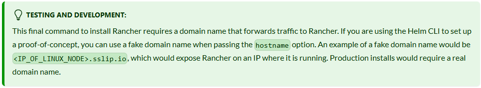

## using Vagrant file for provisioning HA Kubernetes cluster infrastructure

| **Role**         | **FQDN**                   | **IP**           | **OS**         | **RAM** | **CPU** |
|------------------|----------------------------|------------------|----------------|---------|---------|
| Load Balancer    | nginx-lb-01                | 192.168.1.51     | RHEL 8.6       | 2G      | 2       |
| Load Balancer    | nginx-lb-02                | 192.168.1.52     | RHEL 8.6       | 2G      | 2       |
| Rancher Server   | rancher-srv-01             | 192.168.1.101    | RHEL 8.6       | 4G      | 4       |
| Rancher Server   | rancher-srv-02             | 192.168.1.102    | RHEL 8.6       | 4G      | 4       |
| Rancher Server   | rancher-srv-03             | 192.168.1.103    | RHEL 8.6       | 4G      | 4       |
| Agent Worker     | rancher-worker-01          | 192.168.1.201    | RHEL 8.6       | 2G      | 2       |


---------------
# Table of contents:

1. [Install RKE2 kubernetes distribution with HA](#i-install-rke2-with-ha)
2. [Install Rancher GUI](#ii-install-rancher)

---------------


## **I. Install RKE2 with HA:**

1) Setup infrastructure with Vagrant:

    a. 3 x RHEL 8.6 -> rancher-srv-01/02/03 

    b. 2 x RHEL 8.6 -> rancher-worker-01/02

    c. 1 x RHEL 8.6 -> nginx-lb-01 
    
2) Configure networking (disable 10.0.2.15 vagrant interface / set up routing to bridged enp0s8 (192.168.1.1) / set ip) for each provisioned node
3) Launch : ```subscription-manager repos``` (RHEL systems to refresh repositories)
4) Disable firewall d (or configure rules for 9345, 6443, 443, 80) - > ```systemctl stop firewalld```
5) On **nginx-lb-01**:

    a. Install nginx :  ```dnf install nginx```

    b. Configure nginx: use script for load balancing port 9345, 6443, 443, 80 

    c. Set SELinux allowed ports and booleans:
        ```
        semanage port -a -t http_port_t  -p tcp 9345 
        semanage port -a -t http_port_t  -p tcp 6443
        setsebool -P httpd_can_network_connect 1
        ```

    d. Test nginx configuration with : ```nginx -t```

    e. Reload nginx configuration with :  ```nginx -s reload```

    f. Start nginx service : ```systemctl enable --now nginx.service```  (or) ```systemctl start nginx.service```

6) On **rancher-srv-01**:

    a. Create directories (all rancher-srvs):
    ```    
    mkdir -p /etc/rancher/rke2/ 
    mkdir -p /var/lib/rancher/rke2/server/manifests/
    ```    

        
    
    b. (optional) Add ingress monitoring config file (all rancher-srvrs):
    ```
    cat<<EOF| tee /var/lib/rancher/rke2/server/manifests/rke2-ingress-nginx-config.yaml
    ---
    apiVersion: helm.cattle.io/v1
    kind: HelmChartConfig
    metadata:
        name: rke2-ingress-nginx
        namespace: kube-system
    spec:
        valuesContent: |-
        controller:
            metrics:
            service:
                annotations:
                prometheus.io/scrape: "true"
                prometheus.io/port: "10254"
            config:
            use-forwarded-headers: "true"
            allowSnippetAnnotations: "true"
    EOF
    ```
        
    c. For first rancher-srv add config:
    ```
    cat<<EOF|tee /etc/rancher/rke2/config.yaml
    tls-san:
        - 192.168.1.51
        - nginx-lb-01.archipelago.local
    write-kubeconfig-mode: "0600"
    etcd-expose-metrics: true
    cni: cilium
    EOF
    ```
    
    d. Download rancher server packages: ```curl -sfL https://get.rke2.io |INSTALL_RKE2_TYPE="server"  sh - ```

    e. Start first rancher server with: ```systemctl start rke2-server``` (it will take 5-15 mins)

    f. You can monitor progress of installation (in separate terminal window) with : ```systemctl status rke2-server``` (or) ```journalctl -feu rke2-server```

    g. Setup environment variables and aliases for use with plaian kubectl commands:
    ```
    echo "export PATH=$PATH:/var/lib/rancher/rke2/bin" >> $HOME/.bashrc
    echo "export KUBECONFIG=/etc/rancher/rke2/rke2.yaml"  >> $HOME/.bashrc
    source ~/.bashrc
    alias k=kubectl
    ```

    h. Now you can check installation with: ```kubectl get nodes``` (or) ```k get nodes```

    i. Get token from your first server : ```cat /var/lib/rancher/rke2/server/node-token and place it in configuration files (/etc/rancher/rke2/config.yaml)``` for rancher-srv-02 and rancher-srv-03

7) On **rancher-srv-02 / rancher-srv-3**: 

    a. Create directories:
    ```
    mkdir -p /etc/rancher/rke2/
    mkdir -p /var/lib/rancher/rke2/server/manifests/
    ```
    
    b. (optional) Add ingress monitoring config file (all rancher-srvrs):
    ```
    cat<<EOF| tee /var/lib/rancher/rke2/server/manifests/rke2-ingress-nginx-config.yaml
    ---
    apiVersion: helm.cattle.io/v1
    kind: HelmChartConfig
    metadata:
        name: rke2-ingress-nginx
        namespace: kube-system
    spec:
        valuesContent: |-
        controller:
            metrics:
            service:
                annotations:
                prometheus.io/scrape: "true"
                prometheus.io/port: "10254"
            config:
            use-forwarded-headers: "true"
            allowSnippetAnnotations: "true"
    EOF
    ```
        
    c. add config:  (token is acquired from first rancher-srv-01 !! - check 6) i) for that) - server is ip of load balancer : nginx-lb-01)
    
    ```
    cat<<EOF|tee /etc/rancher/rke2/config.yaml
    server: https://192.168.1.51:9345
    token: K104a4118e6d11a3407af6322b1cb94890cd123716920e577f85988e40c64c1a4b3::server:a235c3617ebe7f89f27bd626bf487e52
    tls-san:
        - 192.168.1.51
        - nginx-lb-01.archipelago.local
    write-kubeconfig-mode: "0644"
    etcd-expose-metrics: true
    cni: cilium
    EOF
    ```
    
    d. Start download rancher server packages: ```curl -sfL https://get.rke2.io |INSTALL_RKE2_TYPE="server"  sh - ```
    e. Start rancher server with: ```systemctl start rke2-server``` (it will take 5-15 mins)
    f. You can monitor progress of installation (in separate terminal window) with : systemctl status rke2-server (or) journalctl -feu rke2-server
    
    
8) On **rancher-workers-01/02**:
    
    a. Create directories (all rancher-workers):
    ```mkdir -p /etc/rancher/rke2/```
        
    b. Create config:   (token is acquired from first rancher-srv-01 !! - check 6) i) for that) - server is ip of load balancer : nginx-lb-01):
    ```
    cat<<EOF|tee /etc/rancher/rke2/config.yaml
    server: https://192.168.1.51:9345 
    token: K104a4118e6d11a3407af6322b1cb94890cd123716920e577f85988e40c64c1a4b3::server:a235c3617ebe7f89f27bd626bf487e52
    EOF
    ```
        
    a. Download RKE2 agent packages : ```curl -sfL https://get.rke2.io | INSTALL_RKE2_TYPE="agent" sh - ```

    b. Start (enable) RKE2 agent (worker) : ```systemctl start rke2-agent``` (or) ```systemctl enable --now rke2-agent```
            
        
9) You should get running HA RKE2 cluster:

    


## **II. Install Rancher:**

1) Get helm on rancher-srv-01:

```
curl -fsSL -o get_helm.sh https://raw.githubusercontent.com/helm/helm/main/scripts/get-helm-3
chmod 700 get_helm.sh
./get_helm.sh
```    

2) Add rancher repo: ```helm repo add rancher-stable https://releases.rancher.com/server-charts/stable```

3) Create namespace for rancher: ```kubectl create namespace cattle-system```

4) Install cert-manager (for self signed SSL certificates): ```kubectl apply -f https://github.com/cert-manager/cert-manager/releases/download/v1.16.2/cert-manager.yaml```
        
5) You can test cert-manager installation following this guide: [kubectl apply - cert-manager Documentation](https://cert-manager.io/docs/installation/kubectl/#verify)

6) [rancher dns name explaination for testing/dev purposes](https://ranchermanager.docs.rancher.com/getting-started/installation-and-upgrade/install-upgrade-on-a-kubernetes-cluster#5-install-rancher-with-helm-and-your-chosen-certificate-option)

    


        
7) Install rancher:
```
helm install rancher rancher-stable/rancher  --namespace cattle-system --set hostname=rancher.192.168.1.51.sslip.io --set bootstrapPassword=admin  --wait  --timeout=10m
```        
            
            
You should be able to access rancher on : https://rancher.192.168.1.51.sslip.io/dashboard/?setup=admin


